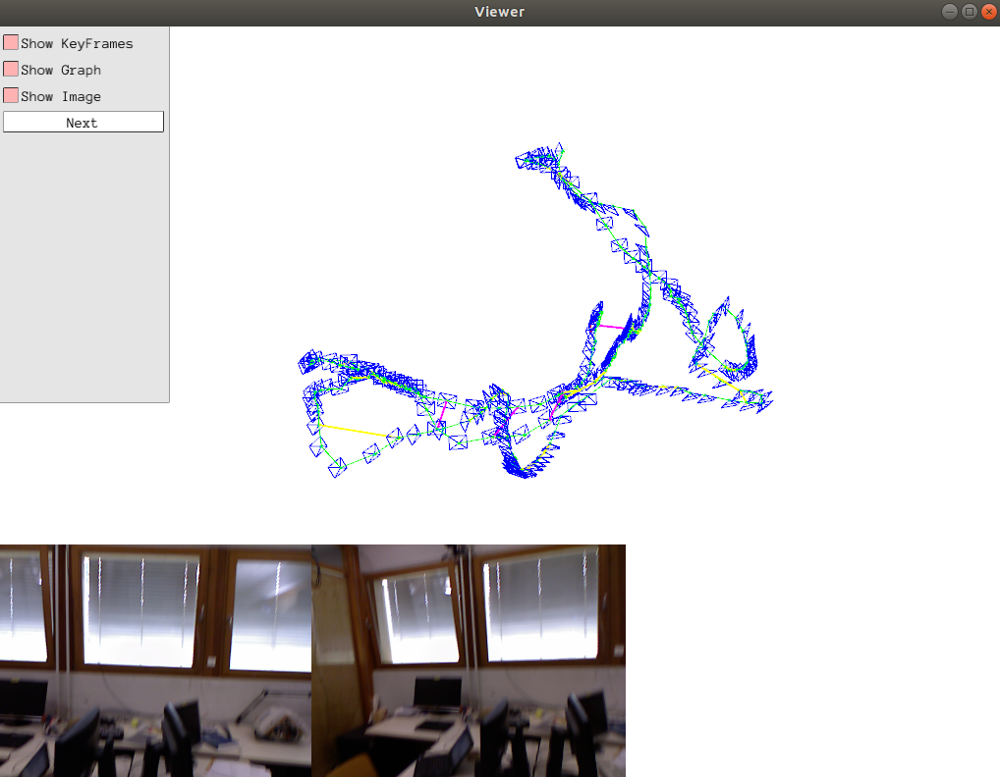

# visual_slam_assignment3
Assignment for lecture3.

## Overview
Implement a simple backend for visual slam system. The requirments are as follows:
- (1) Go through the code ``assignment3.ipynb`` and annotate it richly, especially **pose graph optimization part**, to show that you understand it.
- (2) Add code to complete the functionality in the places indicated by "Required part for student" to perform loop closure detection.
- (3) Experiment with different settings to see how the system behaves in the places indicated by # EXPERIMENT AND ANALYSE.

## Installation
* Python 3.6+
* numpy
* cv2
* [g2o](https://github.com/uoip/g2opy) (python binding of C++ library [g2o](https://github.com/RainerKuemmerle/g2o)) for optimization
* [pangolin](https://github.com/uoip/pangolin) (python binding of C++ library [Pangolin](http://github.com/stevenlovegrove/Pangolin)) for visualization

**Note** Set [view_point_cloud](https://github.com/jiexiong2016/visual_slam_assignment3/blob/ea9a0e21edecced2780ddb322c9f9bacb50a845e/feature.py#L39) to True for enabling point cloud viewer. Recommended for a modern pc. 

## Dataset
Download the dataset from this [link](https://drive.google.com/file/d/1m97TiFV-EQyWm62IfSwoGxczS7F2-0vD/view?usp=sharing) and uncompress it in the project folder. Check the code for more details.

## Example

  

